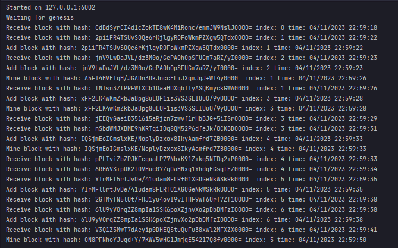

# BlockchainLight

## Описание

Примитивный блокчейн с общением нод по вебсокетам

## Тестирование

`master`:

[](https://github.com/theburyat/BlockchainLight/actions/workflows/tests.yml)

`develop`:

[](https://github.com/theburyat/BlockchainLight/actions/workflows/tests.yml)

## Запуск

* Клонирование репозитория

```
git clone https://github.com/theburyat/BlockchainLight.git
```

* Переход в директорию проекта

```
cd <your path>/BlockchainLight
```

* Сборка с помощью docker compose:

```
docker compose build
```

или

```
docker build -t theburyat/blockchain .
```

* Запуск с помощью docker compose:

```
docker compose up
```

## Демонстрация работы

* node1


* node2



* node3


